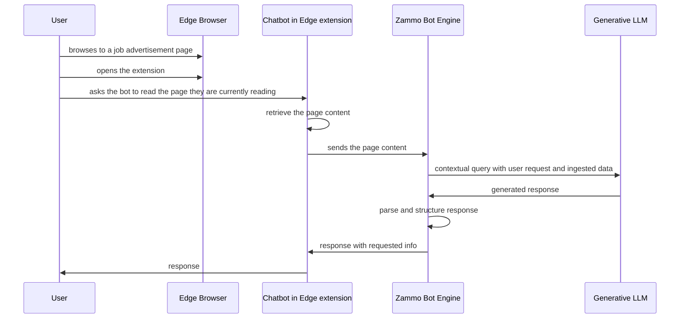

# Employment Accessibility Advancements through Voice AI

## About

This repository contains the research and prototype for Zammo.ai in the context of its AI for Accessibility grant: [Employment Accessibility Advancements through Voice AI](https://sway.office.com/PbI6qD4FCjiqp2Dc?ref=Link).

The overarching goal of the project and prototype aims to use Artificial Intelligence to help job seekers with disabilities enhance their existing interface options in an effort to both improve the experience and success of finding the right job.

The combination of a Zammo chatbot hosted in an edge extension was chosen due to its ability to provide a continuous interface across domains. This allows a job seeker to continue their conversation with the chatbot throughout a job search journey across multiple unrelated job postings, job providers, or web domains.

The Zammo chatbot acts to provide an interface for end users to interact with their content in a conversational manner leveraging artificial intelligence to get relevant information fast through both a voice and/or chat interface, as required by the end user.

The overall project has been a collaborative effort between Zammo.ai, Microsoft, and Open Inclusion.

[Zammo.ai](https://zammo.ai/) is an omni-channel, no-code conversational AI software platform.
[Open Inclusion](https://openinclusion.com/) is a research, design, and innovation consultancy making environments that work better for all.

## Demo

The following is a demo of the end-state prototype and solution that a job seeker can use leveraging a Zammo chatbot and the edge extension code included in this repo.

[Employment Accessibility Advancements through Voice AI Demonstration](https://player.vimeo.com/video/787664464?h=34c8a87e00&badge=0&autopause=0&player_id=0&app_id=58479)

## Research

### TL;DR

People with disabilities face numerous challenges along the job-seeking journey.

Highlights of the issues signaled by job seekers include:

- Finding relevant information about job openings for them
- Understanding how to apply
- Filling out and submitting the job application with the accurate, complete, and formatted details

### Detailed findings

The following includes key research findings from the project as discovered from user surveys, user interviews, focus groups, and usability testing.

[Employment Accessibility Advancements through Voice AI Research Study Findings](https://zammoai.sharepoint.com/:p:/s/EmploymentAccessibilityAdvancementsthroughVoiceAI/EcuAYGUiVLxLodGwUW6b3tsBYIRQA1wKSJ9ot4uW-A9JYw)

## Prototype

Following the research, we moved into a prototyping phase.

We wanted to explore a few ideas we uncovered during the research phase.

The sections below describe the prototype and a guide to help any readers deploy and use it.

### Architecture Overview

At the core idea of the prototype, we aimed to create a companion that could support the user in their job search journey.

The chatbot as an assistant that could both control the browser and also read and translate or transcribe the information on the page appeared to be a possible solution for our needs.

We designed the following interaction:

### Setup

The Setup consists of 4 key components and requirements:

1. Generative large language model.
2. Creation of a Zammo bot
3. Installation of the Microsoft Edge browser
4. Creation of a Microsoft Edge Extension

#### **Generative large language model**

LLM (Large language models) are machine learning models that have been trained on large datasets.

They can be used for many different use cases but one of the more popular ones is **text generation**.

Based on a given _prompt_ the machine learning model can generate a text (of any chosen size) that would complement the prompt.

In our prototype, we use the job content and the user questions as a prompt and provide the model output as a response to the user.

The chatbot needs to access the large language model. OpenAI is a company that offers a large language model as an API.

OpenAI LLM is accessible through:

- [Azure OpenAI Service](https://azure.microsoft.com/en-us/products/cognitive-services/openai-service/)
- [Open AI](https://beta.openai.com/)

* If using Azure OpenAI:

1. Head to [Azure OpenAI Service](https://azure.microsoft.com/en-us/products/cognitive-services/openai-service/)
2. Provision a dedicated service and instance.
3. **Take note of the API key** by going to the keys in the resource blades in the Azure portal.
4. Go to the Azure OpenAI studio. Select experiment with prompt completions. Then under deployments, select _create a new deployment_, then select the Model named _text-davinci-001_ and any Deployment name you want.
5. Once the deployment is completed, go to the _playground_. Ensure that your newly created deployment is selected. Click on _code view_.
6. **Take note of the endpoint URL** near the dropdown with the programming language.

> You should have an endpoint URL and an API key.

- if using OpenAI:

1. Go to `beta.openai.com`.
2. Create or login with the account which will provide the credentials for the bot.
3. Once signed in, under the profile menu (on the top right) select `View API keys`.
4. Generate an API Key and **take note of the API key**.

#### **Creation of a Zammo bot**

The extension leverages a Zammo-built bot to power the experience.

You can create an account for free.

You can create your own Zammo bot by following the steps below or following along with the
[Zammo Bot Creation Walkthrough](https://player.vimeo.com/video/789786908?h=3eec3d4cb8&badge=0&autopause=0&player_id=0&app_id=58479):

1. Going to [app.zammoa.ai](https://app.zammo.ai), creating a business
2. Navigating to [UI Builder](https://builder.zammo.ai/) using your business
3. In UI Builder select the 3 dots (more options) in the lefthand menu next to your businesses bot name
4. Select _Import a .zip for this bot_
5. Import the following file: [Employment-Accessibility-Advancements-through-Voice-AI.zip](https://github.com/zammo-ai/Employment-Accessibility-Advancements-through-Voice-AI-Edge-Extension/files/10451071/Employment-Accessibility-Advancements-through-Voice-AI.zip)
6. In the top right, Save your bot
7. In the configuration section:
> - if you are using Azure Open AI add the config for `config.azureOpenAiHostUrl`, and `config.azureOpenAiApiKey`
> - if you are using Open AI add the config for `config.openAiApiKey`
> 
> Based on your Open AI integration set `config.openAiMode` to `azureopenai` or `openai`.
8. From the top menu, open the Simulator
9. Select "Your Website" and copy the code snippet
10. From the code snippet, **take note of your simulator token**

#### **Installation of the Microsoft Edge browser**

In order to use the extension you will need to have installed the browser [Microsoft Edge](https://www.microsoft.com/en-us/edge) on your computer.

#### **Creation of a Microsoft Edge Extension**

This repo contains [the source code for the Microsoft Edge Extension hosting the Zammo Bot](./applications/edge-extension/README.md).

Follow the guide on the page for information on the setup.

## Usage

Make sure to pin the extension to the navigation bar so it's accessible without having to hover over the extension's icon all the time.

The first time you click on the extension, it will ask for a webchat ID. The ID corresponds to the ID of the webchat the system will interact with.

- If you have access to a Zammo organization with a plan, You can use the webchat ID. You can find it on the channels page, by selecting Webchat and copying the webchat code for the bot. In that webchat code, you will find an ID that you can copy and use.
- Otherwise, on the Conversation Design Q&A, or inside UI Builder, click on the _Simulator_ button. In the subsequent modal, select Webchat. Ensure that the token for the webchat is valid, otherwise, make sure to refresh it. Copy the code for the webchat. In that webchat code, find the simulator token and copy it.

In the first view of the extension, paste the simulator token or the webchat ID.

It should initiate the bot and allow you to interact with it.

## Maintenance

### Known Issues

With UI Kit (the chatbot interface of Zammo) there are a few currently known limitations highlighted below:

- When using a screen reader there is no dedicated auditory cue when new message(s) are received
- When using a screen reader, if multiple messages are sent back from the bot at once the sequence is not automatically queued and read to the user. The user is required to tab between the different message content

Zammo continues to do usability and accessibility testing of its chatbot interface and regularly completes releases of its UI Kit that includes both fixes and features. If there are any unidentified issues please let us know!

## Reporting Vulnerabilities

To report a vulnerability, please e-mail support@zammo.ai with the subject line of "Employment Accessibility Advancements through Voice AI - Bot Issue", a description of the issue, the steps you took to create the issue, affected versions, and if known, mitigations for the issue.

## Media

For more information about Zammo.ai and the project, you can keep in touch with us here:

- [Zammo.ai Homepage](https://zammo.ai/)

- [Voice AI Breaks Down Barriers to Job Application](https://zammo.ai/voice-ai-breaks-down-barriers-to-job-application/)

- [Disability-Inclusive Insight Informs Better Experiences for Job Seekers](https://zammo.ai/disability-inclusive-insight-informs-better-experiences-for-job-seekers/)

- [How AI is being used to improve disability employment](https://blogs.microsoft.com/accessibility/how-ai-is-being-used-to-improve-disability-employment/)

## Appreciation

A quick note from Zammo.ai:

> Many thanks to the Open Inclusion and Microsoft Teams for providing valuable resources and support!
>
> Thanks also to the Azure product suite(s) and OpenAI for the powerful technologies that are used in this project.
>
> Thank you to all upcoming contributors that will continue to bring this project even further and the mission to do good!
